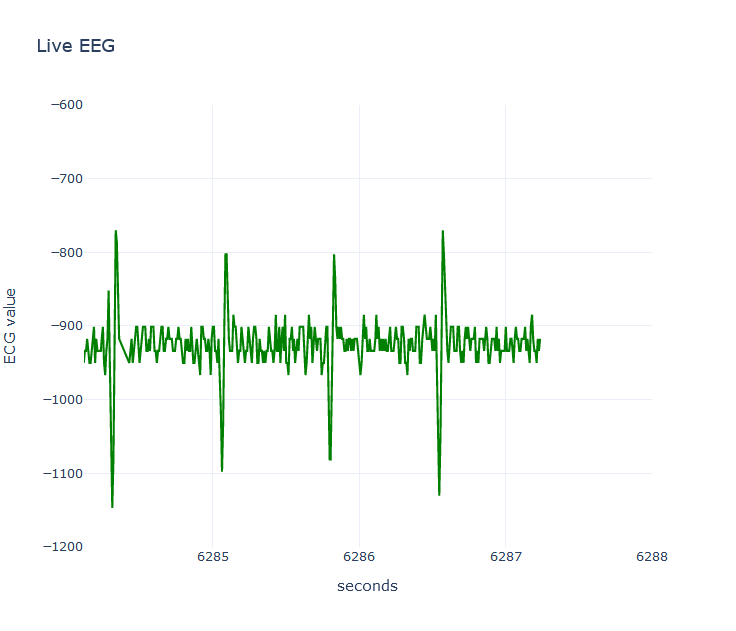
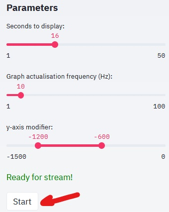

# Geneva_Health_Forum-HeartyPatch

This projet represents a demo for the Geneva Health Forum (https://dev.ghf2020.org/), taking place in 2020 November 16-17-18. Relative to open hardware in Health case, this case provides a python application to live stream HeartyPatch ECG sensor (https://heartypatch.protocentral.com/). 




## Installation


Creating the python virtual environnement with all the dependencies:
```bash
make install
```


## How-To


Create a wifi hotspot as follow:
- SSID : Heartypatch
- Password : 12345678

Hearty patch will connect with last TCP firwmare (https://github.com/patchinc/heartypatch/releases/tag/v2.3)


In a terminal, start streamlit:
```bash
make streamit
```

In a terminal, start a stream:
```bash
make hp_stream
```
Click on start icon




## Status


App is in beta phase.


## Acknowledgement


Scripts of TCP protocol forked from HeartyPatch Github:

https://github.com/patchinc/heartypatch/tree/master/python

**References**
- Geneva Health Forum : https://dev.ghf2020.org/
- Hearty Patch Github : https://github.com/patchinc/heartypatch/
